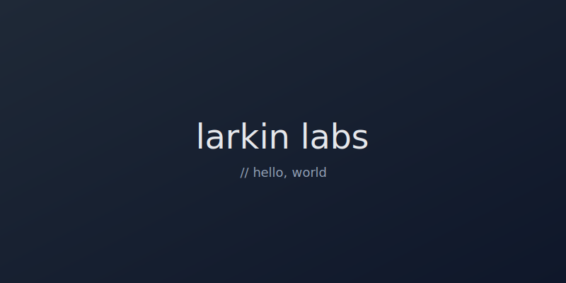

This is the first post on Larkin Labs. The site is built with [Hugo](https://gohugo.io) using the [PaperMod](https://github.com/adityatelange/hugo-PaperMod) theme, deployed to Cloudflare Pages.

## Why a static site

Posts are markdown files in a git repo. Publishing is `git push`. No database, no admin panel, no monthly cost.

## Code blocks work

```python
def greet(name: str) -> str:
    return f"hello, {name}"

print(greet("world"))
```

```go
package main

import "fmt"

func main() {
    fmt.Println("hello, world")
}
```

## Images

Drop an image next to `index.md` and reference it by filename:



That's it. More to come.
